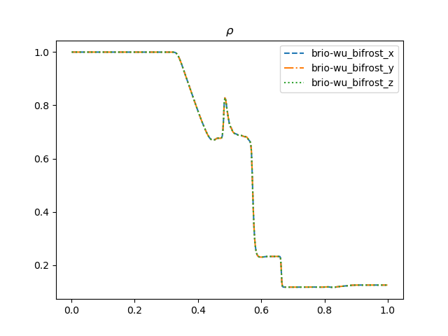
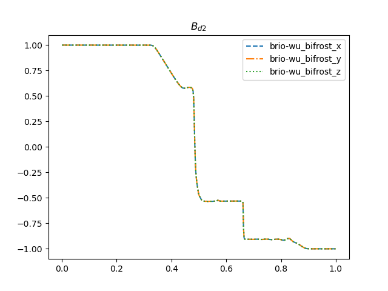
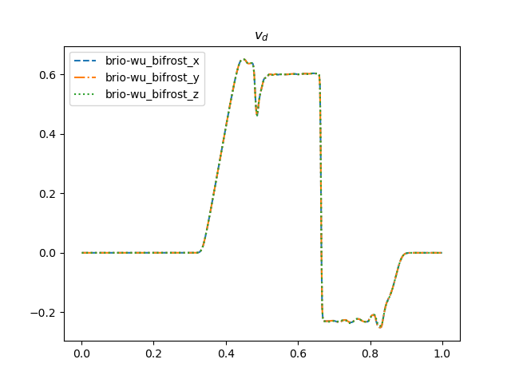
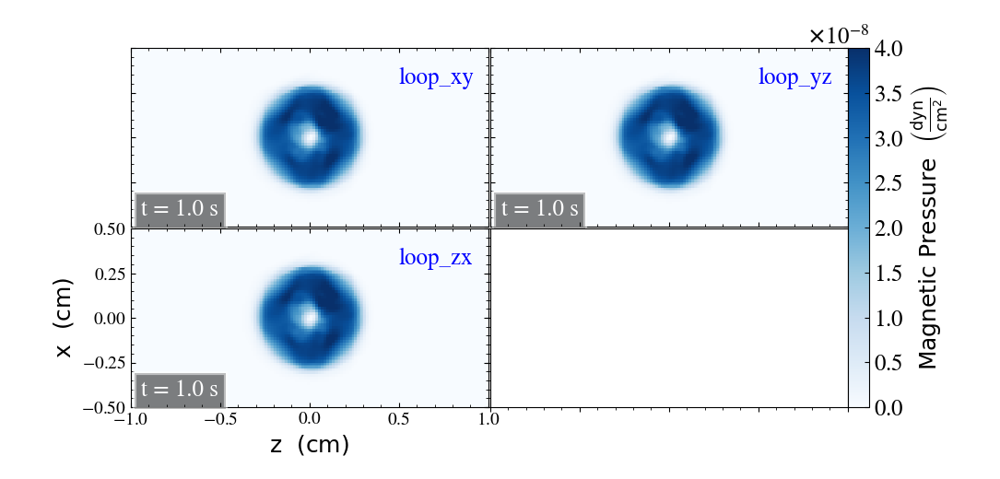

## Welcome to Dispatch-Bifrost CI pages 

Here are the results from the last run associated with 
**Dispatch-Bifrost develop-comparison-tool, build #8**

## Brio & Wu results

  {: style="width:400px"}
  {: style="width:400px"}
  {: style="width:400px"}
  
  **[Comparison to reference](tables/brio-wu.md)**

## Advection of a Magnetic Field Loop 

  
  
  **[Comparison to reference](tables/MagLoopAdvection.md)**

## Stdout on Jenkins terminal
  - [Link to output](output_file.txt)
  

