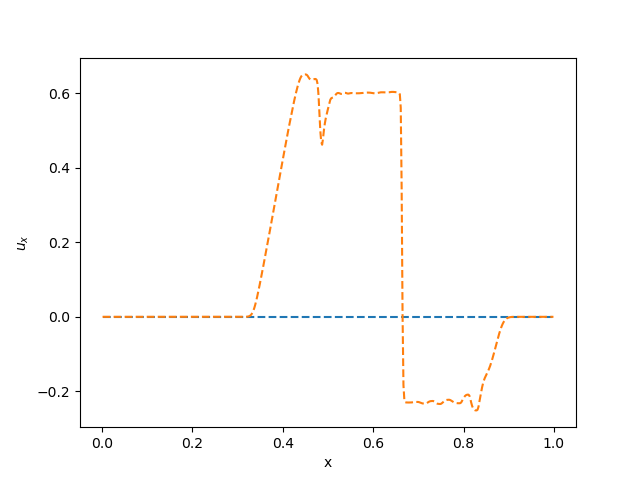
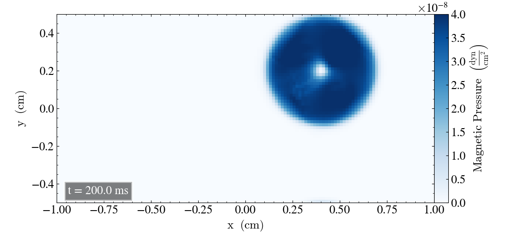

## Reference plots to the Tests

These plots can be a preliminar reference to the current experiments running in the test suite

## Brio & Wu

{: style="width:400px"}
{: style="width:400px"}
{: style="width:400px"}

## Advection of Magnetic Field Loop

{: style="width:400px"}
{: style="width:400px"}
{: style="width:400px"}
{: style="width:400px"}

{: style="width:500px"}

