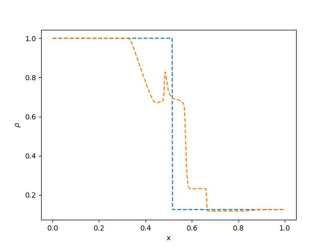
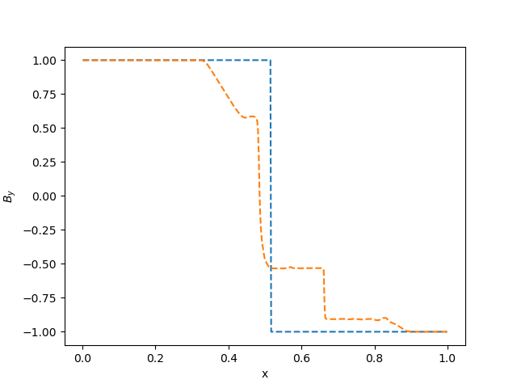
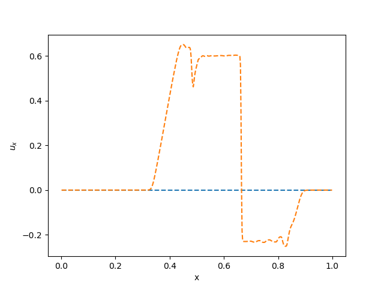
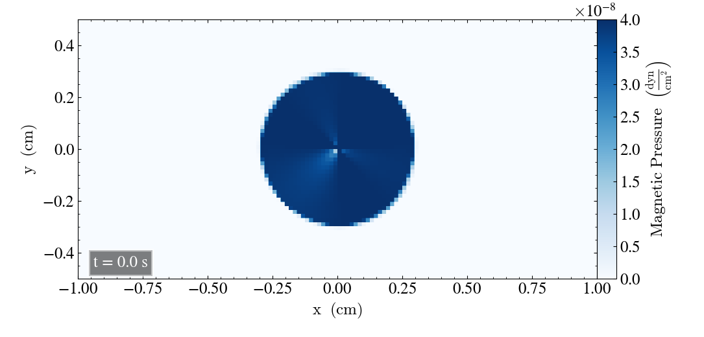
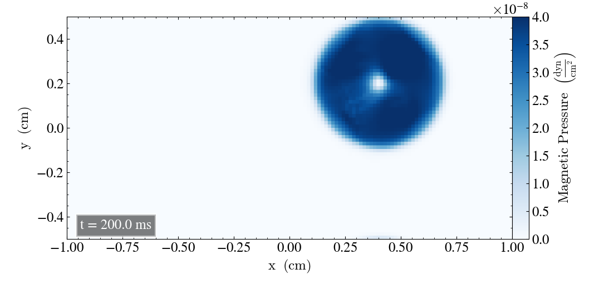
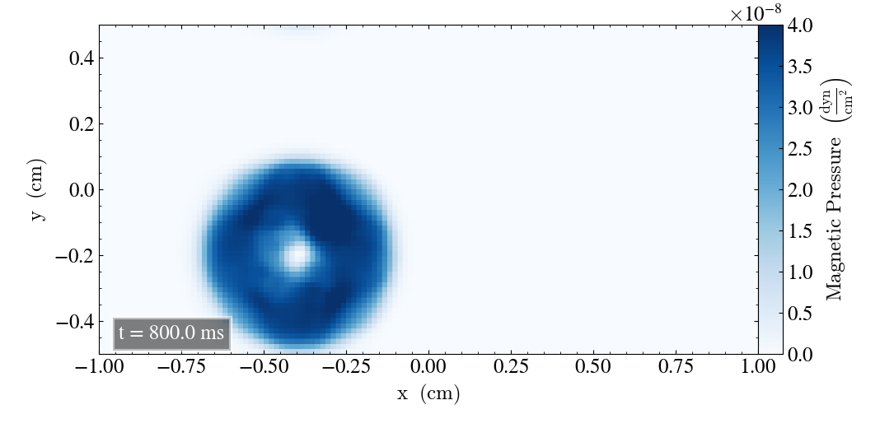
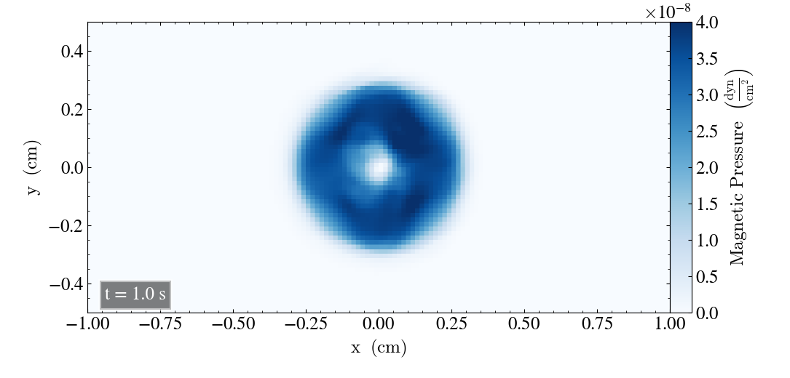
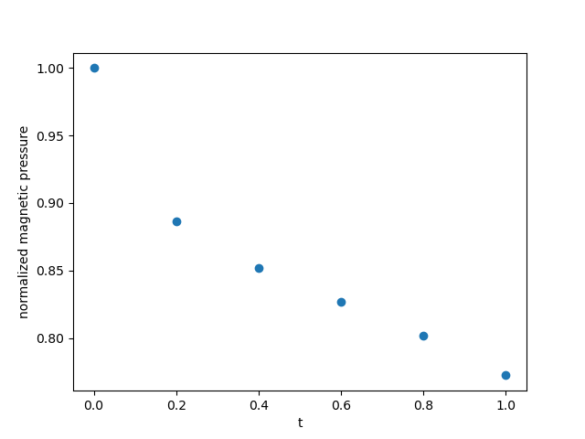

## Reference plots to the Tests

These plots can be a preliminar reference to the current experiments running in the test suite

## Brio & Wu

   
   

   

## Advection of Magnetic Field Loop

   
   

   
   

{: style="width:500px"}

