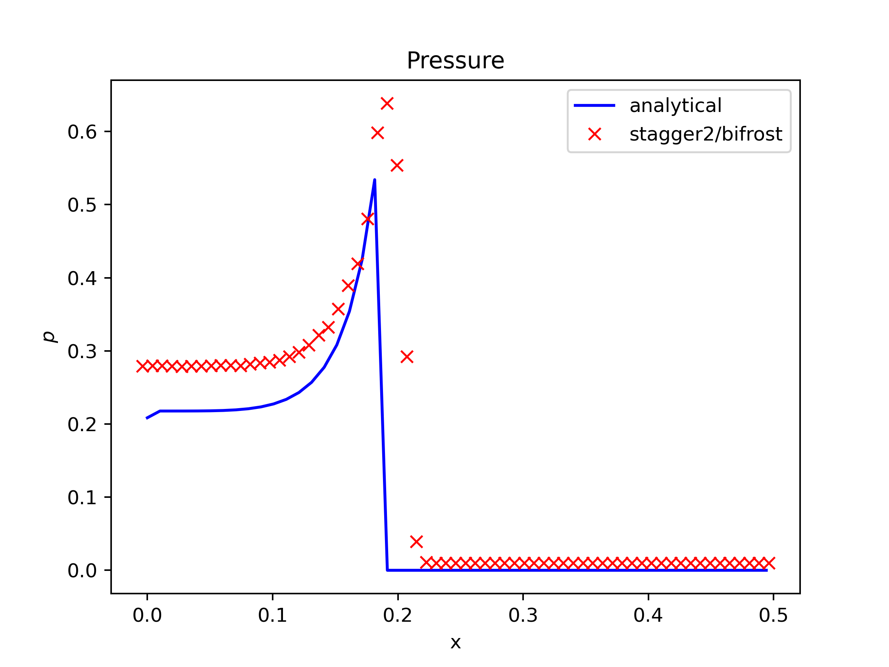
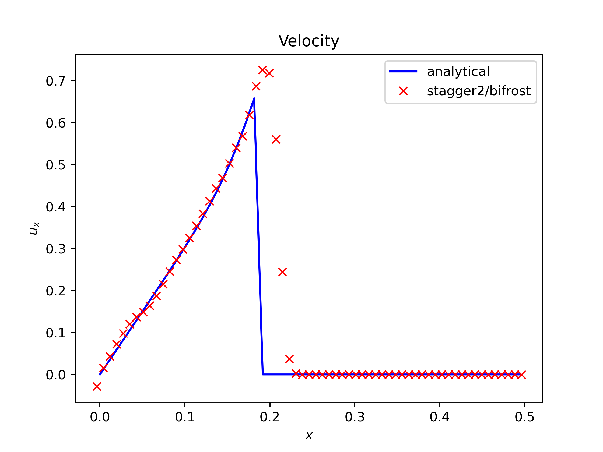
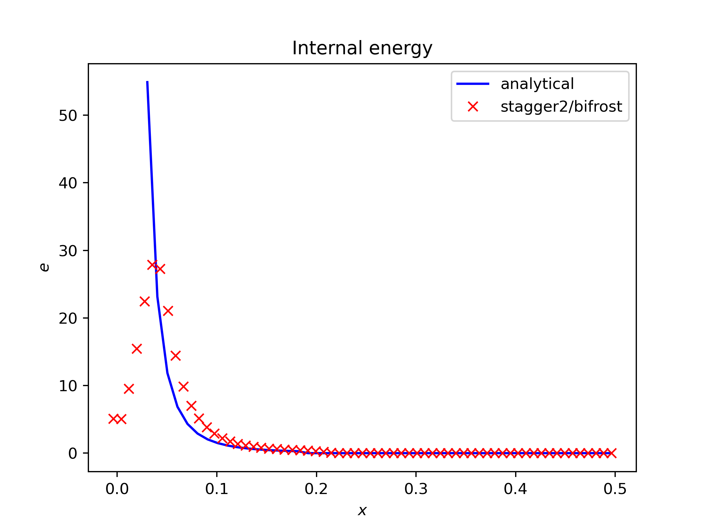

# Weekly test suite results

Here are the results from the weekly run associated with Dispatch-Bifrost

## Sedov Blast comparison to analytical results

  {: style="width:400px"}
  {: style="width:400px"}
  {: style="width:400px"}
  {: style="width:400px"}

## Stdout on Jenkins terminal

Here is the output from the weekly test:

- [Link to output](output_file_weekly.txt)

